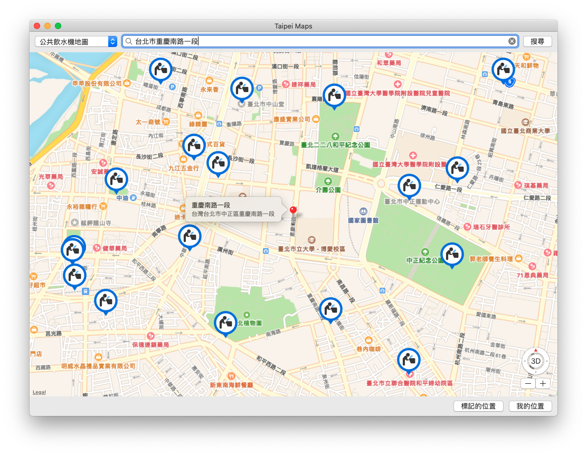

# Taipei Maps 🗺 - macOS 版本

*台北生活的工具地圖*

## 地圖列表

- 公共飲水機
- 自來水直飲臺
- Taipei Free 熱點
- 自行車停放區
- 行人清潔箱 (垃圾桶)

## TODO (待加入)

- 垃圾清運點位 (垃圾車)
- 台北市公廁
- 新北市公廁

## CC0 1.0 公眾領域貢獻宣告

本專案目錄下的程式碼，由作者 WL. 在法律許可的範圍內，拋棄該著作依著作權法所享有之權利，包括所有相關與鄰接的法律權利，並宣告將該著作貢獻至公眾領域。

- [https://creativecommons.org/publicdomain/zero/1.0/deed.zh_TW](https://creativecommons.org/publicdomain/zero/1.0/deed.zh_TW)

