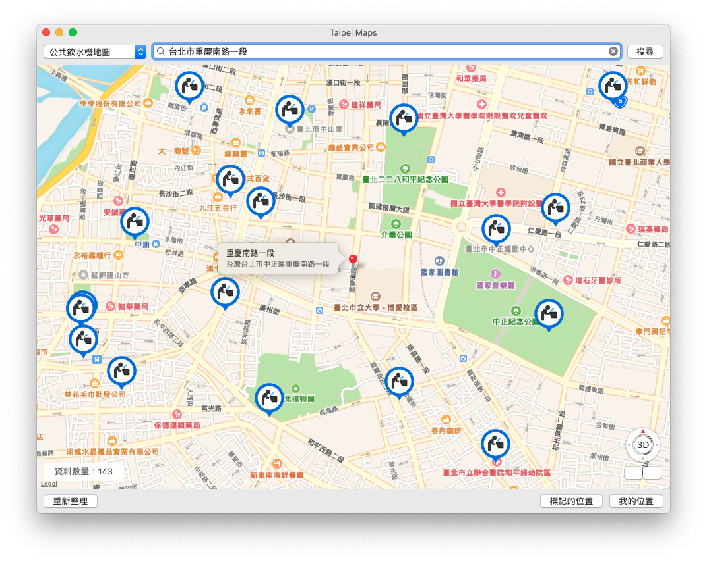
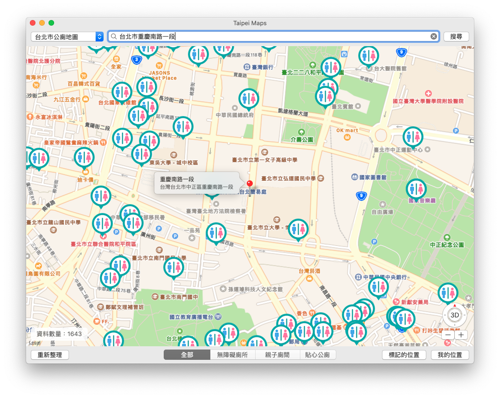
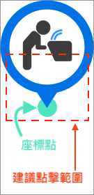

# Taipei Maps 🗺 - macOS 版本

*台北生活的工具地圖*

## 地圖列表

- 公共飲水機
- 自來水直飲臺
- Taipei Free 熱點
- 自行車停放區
- 垃圾清運點位 (垃圾車)
- 行人清潔箱 (垃圾桶)
- 台北市公廁
- 新北市公廁
- 郵局營業據點

## TODO (待處理)

- 繪製 App Icon。 

## 講個秘訣

1. 搜尋地址的功能目前是用 Apple 的 CLGeocoder 去處理，所以在輸入地址時越詳細越好。例如，我輸入「台北市重慶南路」時，會定位到台東市，很怪吧?😅，但是輸入「台北市重慶南路一段」就能定位到台北市重慶南路，所以地址越詳細較能正常定位。
2. 關於點按 Pin：因為 Pin 的圖像是長方形的，圖示是放在上半部，這樣尖頭才能剛好指到座標點，所以點按位置盡量往座標點點擊，如下圖所示：

 

## CC0 1.0 公眾領域貢獻宣告

本專案目錄下的程式碼，由作者 WL. 在法律許可的範圍內，拋棄該著作依著作權法所享有之權利，包括所有相關與鄰接的法律權利，並宣告將該著作貢獻至公眾領域。

- [https://creativecommons.org/publicdomain/zero/1.0/deed.zh_TW](https://creativecommons.org/publicdomain/zero/1.0/deed.zh_TW)

